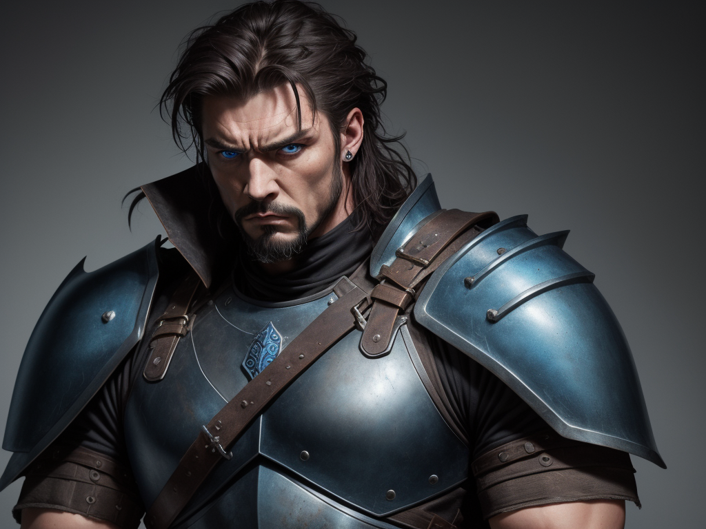
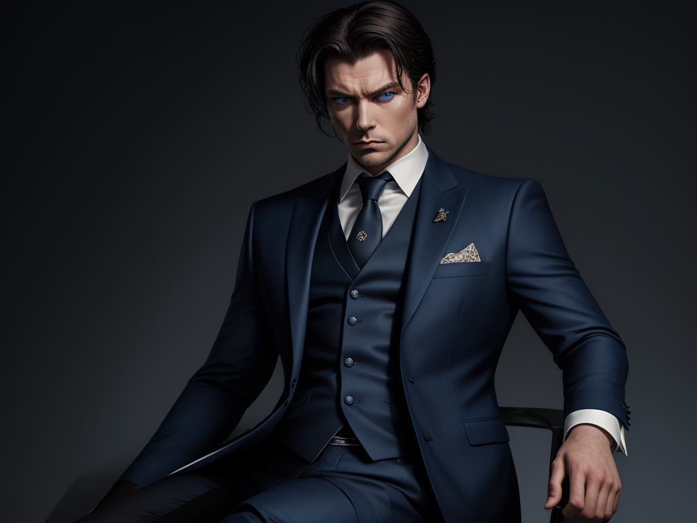
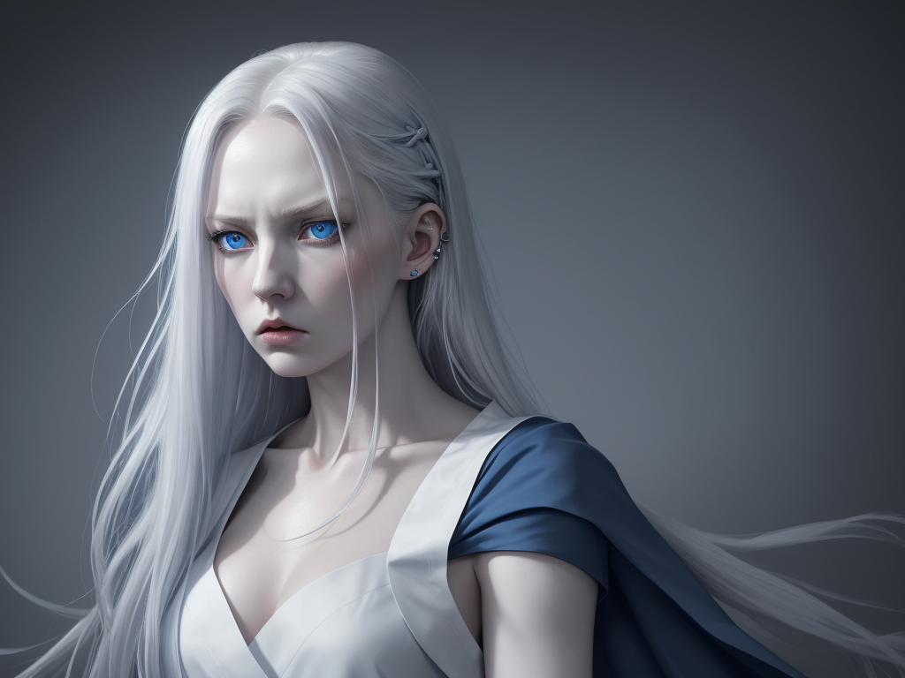

# ComfyUI Character Generator Nodes

A collection of custom nodes for ComfyUI that uses Google's Gemini API to generate Character backstories and corresponding Stable Diffusion prompts for character portrait generation.

## Features

- **Character Backstory Generator**: Creates detailed character backstories and dialogue using Gemini AI
- **Backstory to Prompt Converter**: Converts character descriptions into optimized Stable Diffusion prompts
- **Multiple Art Style Support**: Supports various art styles including realistic, fantasy, anime, and painterly
- **Customizable Generation**: Control narrative depth, dialogue style, and character traits

## Prerequisites

### Required Custom Nodes
The following custom nodes should be installed via ComfyUI Manager:
- ComfyUI Manager
- ControlNet Auxiliary Preprocessors
- RgThree's ComfyUI nodes


## Installation

1. Install ComfyUI from the [official repository](https://github.com/comfyanonymous/ComfyUI)
2. Clone this repository into your `custom_nodes` directory.

3. Create a `config.json` file in the root directory of the custom node:
```json
{
    "gemini_api_key": "YOUR_GEMINI_API_KEY",
    "model_name": "gemini-pro",
    "default_narrative_depth": 3,
    "default_dialogue_style": "casual"
}
```
4. Install required dependencies:
```bash
pip install google-generativeai
```

## Usage

### Character Backstory Generator Node

This node generates character backstories and dialogue lines using Google's Gemini API.

Inputs:
- `api_key`: (Optional) Google Gemini API key (can be set in config.json instead)
- `character_role`: The role/occupation of the Character (e.g., "merchant", "guard", "wizard")
- `personality_traits`: Comma-separated personality traits
- `environment`: The setting where the Character lives/works
- `narrative_depth`: Level of detail in backstory (1-5)
- `dialogue_style`: Style of Character's dialogue
- `custom_prompt`: (Optional) Custom prompt template

Outputs:
- `Backstory`: Generated character backstory
- `Dialogue`: List of characteristic dialogue lines

### Backstory to Prompt Node

Converts character descriptions into optimized prompts for Stable Diffusion image generation.

Inputs:
- `backstory`: Character description text
- `art_style`: Choose from realistic, fantasy, anime, or painterly
- `gemini_api_key`: (Optional) Override the API key from config.json

Outputs:
- `positive_prompt`: Generated positive prompt for Stable Diffusion
- `negative_prompt`: Generated negative prompt for Stable Diffusion

## Example Generations

| Backstory | Parameters | Generated Image |
|-----------|------------|-----------------|
| Born in the harsh, unforgiving lowlands, Brutus learned early that survival meant strength. He was a scrawny kid, picked on relentlessly, until he found a mentor in a grizzled, retired gladiator. Under the man's brutal tutelage, Brutus transformed. He dedicated himself to rigorous training, sculpting his body into a mountain of muscle. His mentor instilled in him a code: protect the weak, and never back down from a fight, no matter the odds. Tragedy struck when a raiding party destroyed Brutus's village and killed his mentor. Filled with grief and rage, he swore to avenge them and to ensure no one else would suffer the same fate. He roams the land, a lone warrior, seeking out injustice and punishing evildoers. | **Gender**: Male<br>**Role:** Hero<br>**Traits:** muscular, aggressive<br>**Environment:** ground<br>**Art Style:** fantasy<br> |  |
Zephyrin's true motives are known only to himself. Does he seek wealth, power, or something more esoteric? Whatever his goals, they are interwoven with his business. He sees his shop not just as a means of making a living, but as a stage to play out his machinations. He is careful to never display any signs of weakness. His cunning mind is perpetually calculating. He plays every interaction like a game of chess, always several steps ahead, making sure that the players in his game don't see the board. | **Gender**: Male<br>**Role:** Merchant<br>**Traits:** cunning, charismatic, mysterious<br>**Environment:** bustling marketplace<br>**Art Style:** painterly<br>|  |
Artemisia’s research has not been without its challenges or moral compromises. She has made questionable decisions, and developed a certain detached perspective on the consequences of her actions. Some believe that the disappearance of the woman before her and the current manifestation of Dr. Thorne are two entirely separate entities. The lab itself is testament to this duality – a chaotic fusion of order and chaos, with meticulously organized shelves overflowing with ingredients and strange contraptions sitting amidst trails of spilled chemicals and arcane symbols scrawled onto every surface. The line between genius and madness is a fine one, and Artemisia walks it with a disconcerting ease, forever driven forward by the promise of breakthrough. | **Gender**: Female<br>**Role:** Scholar/Alchemist<br>**Traits:** brilliant, determined, eccentrics<br>**Environment:** hidden laboratory/library<br>**Art Style:** realistic<br> | 


## Configuration

The `config.json` file supports the following options:
- `gemini_api_key`: Your Google Gemini API key
- `model_name`: Gemini model to use (default: "gemini-pro")
- `default_narrative_depth`: Default depth of backstory (1-5)
- `default_dialogue_style`: Default dialogue style
